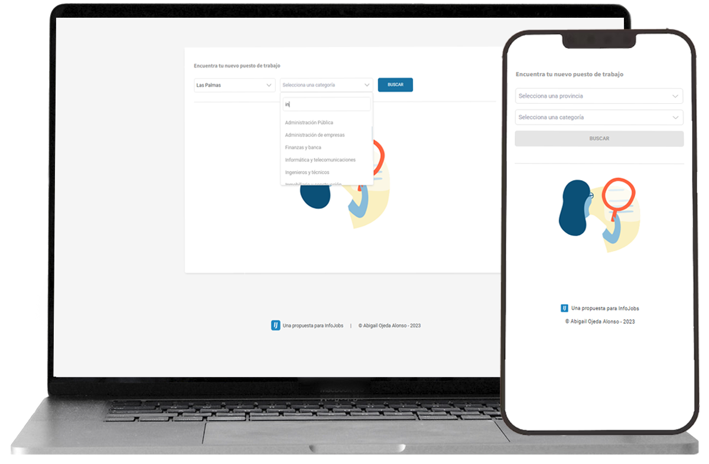
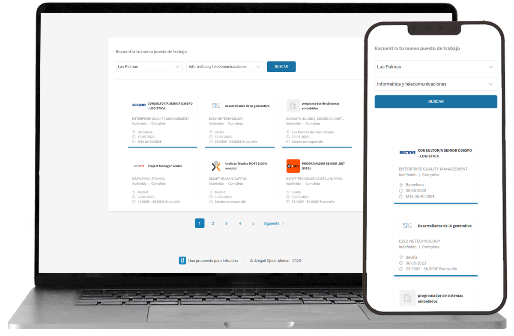
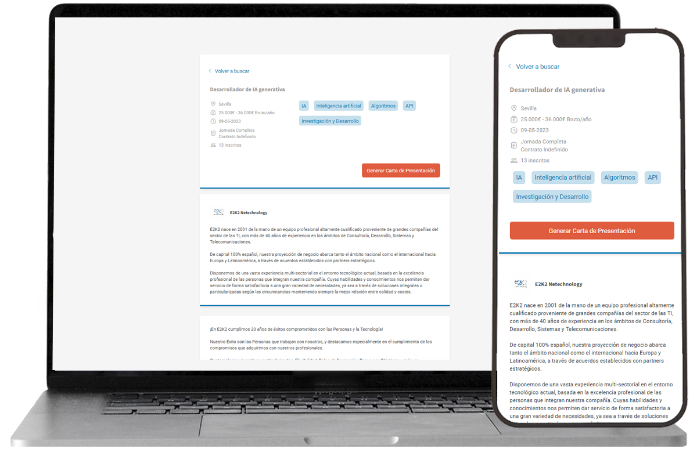
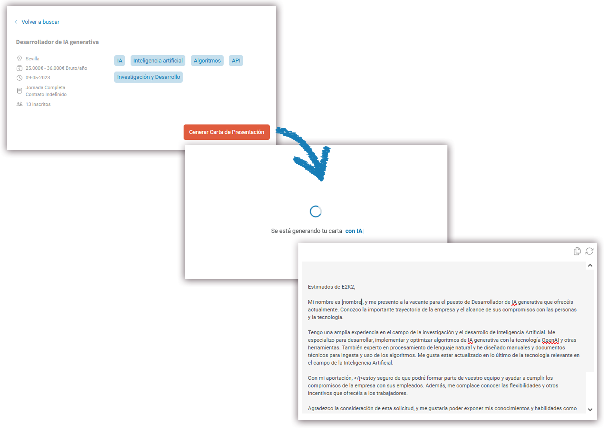
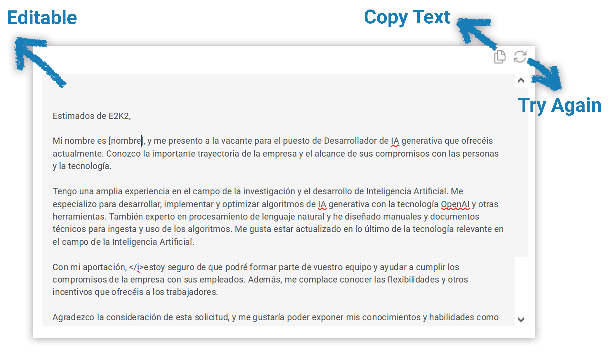

# 📋 Cover Letter Generator - Infojobs 💼🤖  

Con motivo del Hackathon de Infojobs con Midudev, he llevado a cabo esta propuesta d implementación de una funcionalidad nueva en la app de Infojobs.  
He pensado que sería muy útil contar con una herramienta para generar automáticamente cartas de presentación, eso que tanto trabajo cuesta a veces.
Creo que sería muy cómodo que al seleccionar una oferta de trabajo, exista una opción para generar la cara de presentación simplemente pulsando un botón.  
Y que mejor momento que este para lanzarse a explorar las opciones que la IA nos aporta para esto.  

✨👉[Demo](https://infojobs-hackathon-abigail.vercel.app/offers)  

## 👌 Objetivos alcanzados:  

En el transcurso de esta hackathon me ha dado tiempo de desarrollar algunos de los objetivos que me planteé con este proyecto:  

➜ Hacer buscador de ofertas simplificado, filtrando por provincia y categoría   
➜ Paginación de resultados  
  
     

➜ Mostrar detalle de oferta con información detallada  
  
   

➜ Generar carta con api de OpenAI teniendo en cuenta el título, la descripción y los requisitos mínimos de la oferta.  
➜ Mostrar animación mientras la carta se genera, ya que la API de openAI puede demorarse en devolver la respuesta
  
     
    
➜ Que la carta resultante sea editable  
➜ Crear funcionalidad para copiar la carta con un solo click  
➜ Que pueda volver a generarse otra carta  
    
     
    

## 🚧 Objetivos aún en progreso:  
  
Objetivos que me planteé pero no me dio tiempo de alcanzar:  
  
➜ Generar carta teniendo en cuenta el CV y skills del usuario  
➜ Que la carta pueda guardarse como PDF  
➜ Que la carta pueda guardarse en el perfil del usuario  

---  
## 👩🏻‍💻 Stack tecnológico:

Esta demo del proyecto la he desarrollado con [Angular](https://angular.io/) v14.  
Además he utilizado las APis de Infojobs y OpenAI: 

➜  [Infojobs](https://developer.infojobs.net/)  
➜  [OpenAI](https://platform.openai.com/docs/api-reference)  

---
 🙋🏻‍♀️ [Abigail Ojeda Alonso](https://es.linkedin.com/in/abigail-ojeda)

